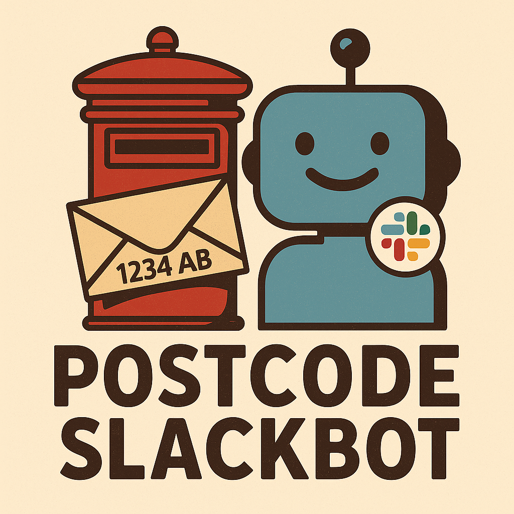

# Postgres Slackbot

Slackbot voor adres- en postcode-zoekopdrachten vanuit een PostgreSQL database.

---

<p align="center">
  
</p>

---

## Features
- `/adres Straat Huisnummer Plaats` → zoekt fuzzy met pg_trgm
- `/adres Postcode Huisnummer` → zoekt direct op postcode
- Resultaten inclusief Google Maps link en optioneel kaartje

## Installatie
```bash
git clone https://github.com/<jouw-account>/mijn_postgres_slackbot.git
cd mijn_postgres_slackbot
npm install
